# Data Ingestion and Storage

## Data Engineering Fundamentals

### Types of Data

#### Structured Data

- Definition: Data that is orgnizied in a defined manner or schema, typically found in relational databases
- Characteristics:
    - Easily queryable
    - Organized in rows and columns
    - Has a consistent structure
- Examples:
    - Database tables
    - CSV files with consistent columns
    - Excel spread sheets

#### Unstructured Data

- Definition: Data that doesn't have a predefined structure or shcema
- Characteristics:
    - Not Easily queryable without preprocessing
    - May come in various formats
- Examples:
    - Text files without a fixed formats
    - Videos and audio files
    - Images
    - Emails and word processing documents

#### Semistructured Data

- Definition: data that is not as organized as structured data but has some level of structure in the form of tags, hierarchies, or other patterns.
- Characteristics:
    - Elements might be tagged or categorized in some way
    - More flexible than structured data but not as chaotic as unstructured data
- Examples:
    - XML and JSON files
    - Email headers (which have a mix of structured fields like date, subject, etc and unstructured data in the body )
    - Log files with varied formats

### Properties of Data

#### Volume

- Definition: Refers to the amount or size of data that organizations are dealing with at any given time.
- Characteristics:
    - May range from gigabytes to petabytes or even More.
    - Challenges in storing, processing, and analyzing high volumes of data.
- Examples:
    - A popular social media platform processing terabytes of data daily from user posts images, and videos.
    - Retailers collecting years' worth of transaction data, amounting to several petabytes.

#### Velocity

- Definition: Refers to the speed at which new data is generated, collected, and processed
- Characteristics:
    - High velocity requires real-time or near-real-time processing capabilities.
    - Rapid ingestion and processing can be critical for certain applications.
- Examples:
    - Sensor data from IoT devices Streaming readings every milisecond.
    - High-frequency trading systems where milliseconds can make a diffrence in decision-making.

#### Variety

- A business analyzing data from relational databases (structured), emails (unstructured), and JSON logs (semi-structured).
- Healthcare systems collecting data from electronic medical records, wearable, health devices, and patient feedback forms.

## Data Warehouses, Lakes and Lakehouses

### Data Warehouse

- Definition: A centralizied repository optimizied for analysis where data from different sources is stored in a structured format.
- Characteristics:
    - Designed for complex queries and analysis.
    - Data is cleaned, transformed, and loaded (ETL process).
    - Typically uses a star or snowflake schema.
    - Optimized for read-heavy operations.
- Examples:
    - Amazon Redshift
    - Google BigQuery
    - Microsoft Azure SQL Data Warehouse

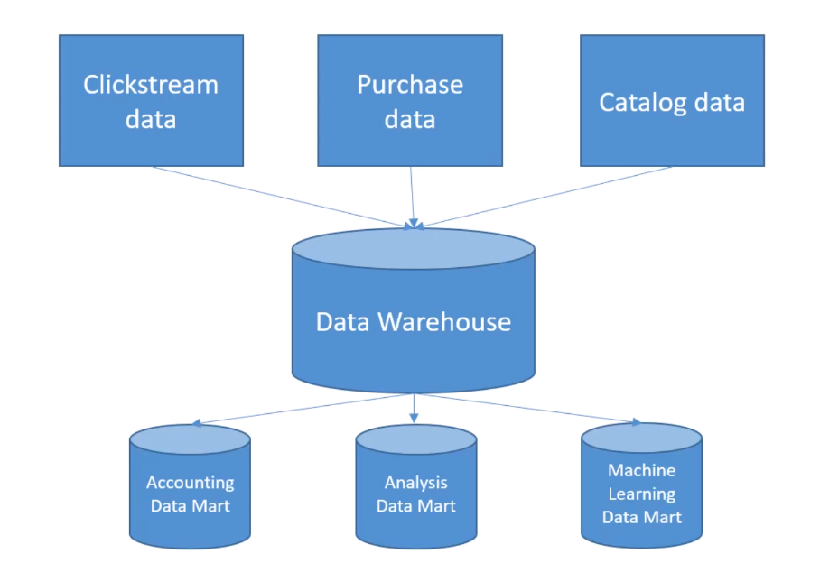

### Data Lake

- Definition: A storage repository that holds vast amounts of raw data in its native format, including structured, semi-structured, and unstructured data.
- Characteristics:
    - Can store large volumes of raw data without predefined schema
    - Data is loaded as-is, no need for preprocessing
    - Supports batch, real-time, and stream processing
    - Can be queried for data transformation or exploration purposes
- Examples:
    - Amazon Simple Storage Serivce (S3) when used as a data lake
    - Azure Data Lake Storage
    - Hadoop Distributed File System (HDFS)

### Comparing the two

- Schema:
    - Data Warehouse: Schema-on-write (predefined shcema before writing data)
        - Extract - Transform - Load (ETL)
    - Data Lake: Schema-on-read (schema is defined at the time of reading data)
         - Extract - Load - Transform (ELT)
- Data Types:
    - Data Warehouse: Primarily structured data
    - Data Lake: Both structured and unstructured data
- Agility:
    - Data Warehouse: Less agile due to predefined schema
    - Data Lake: More agile as it accepts raw data without a predefined structure
- Processing:
    - Data Warehosue: ETL (Extract, Transform, Load)
    - Data Lake: ELT (Extract, Load, Transform) or just Load for storage purposes
- Cost:
    - Data Warehouse: Typically more expensive because of optimizations for compex queries
    - Data Lake: Cost-effective storage solutions, but costs casrise when processing large amounts of data

### Choosing a Warehouse vs a Lake

- Use a Data Warehouse when
    - You have structured data sources and require fast and complex queries.
    - Data interation from different sources is essential.
    - Buisness intelligence and analytics are the primary use cases.
- Use a Data Lake when:
    - You have a mix of structured, semi-structured, or unstructured data
    - You need a scalable and cost-effective solution to store massive amounts of data.
    - Future needs for data are uncertain, and you want flexibility in storage and processing
    - Advanced analytics, machine learning, or data discovery are key goals.

### Data Lakehouse

- Definition: A hybrid data architecture that combines the best features of data lakes and data warehouses, aiming to provide the performance, reliability, and capabilities of a data warehouse while maintaining the flexibility, scale, and low-cost storage of data lakes.
    - Characteristics:
        - Supports both structured and unstructured data.
        - Allows for schema-on-write and schema-on-read.
        - Provides capabilities for both detailed analytics and machine learning tasks.
        - Typically built on top of cloud or distribited architectures.
        - Benefits from technologies like Delta Lake, which bring ACID transactions to big data.
    - Examples:
        - **AWS Lake Formation (with S3 and Redshift Spectrum)**
        - **Delta Lake**: An open-source storage layer that brings ACID transactions to Apache Spark and big data workloads.
        - **Databricks Lakehouse Platform**: A unified platform that combines the capabilities of data lakes and data warehouses.
        - **Azure Synapse analytics**: Microsoft's analytics service that brings together big data and data warehousing.

## Data Mesh

- Coined in 2019: it's more about governance and organization
- Individual teams own "data products" within a given domain
- These data products serve various "use cases" around the organization
- "Domain-based data management"
- Federated governance with central standards
- Self-service tooling & infrastructure
- Data lakes, warehouses, etc. may be part of it
    - But a "data mesh" is more about the "data management paradigm" and not the specific technologies or architectures

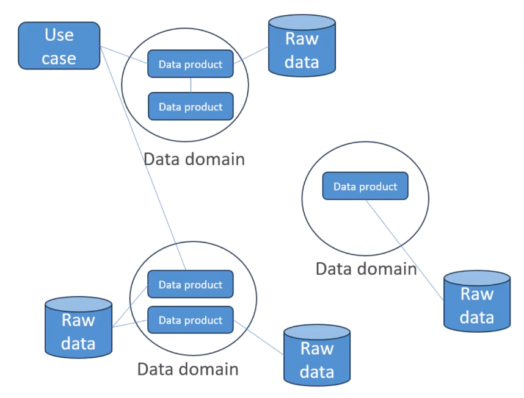

## ETL & ELT Pipelines and Orchestration

### ETL Pipelines

- **Definition**: It's a process used to move data from source systems into adata warehouse.

### ETL Pipelines:Extract

- Retrieve raw data from source systems, which can be databases, CRMs, flat files, APIs, or other data repositories
- Ensure data integrity during the extraction phase.
- Can be done in real-time or in batches, depending on requirements

### ETL Pipelines: Transform

- Convert the extract data into a format suitable for the target data warehouses
- Can involve various operations such as:
    - Data cleansing
    - Data enrichment
    - Format changes
    - Aggregations or computations
    - Encoding or decoding data
    - Handling missing values

### ETL Pipelines: Load

- Move the transformed data into the target data warehouse or another data repository.
- Can be done in batches (all at once) or in a streaming manner (as data becomes available)
- Ensure that data maintains its integrity during the loading phase

### Managin ETL Pipelines

- This process must be automated in some reliable way
- AWS Glue
- Orchestration services
    - EventBridge
    - Amazon Managed Workflows for Apache Airflow [Amazon MWAA]
    - AWS Step Functions
    - Lambda
    - Glue Workflows
- We'll get into specific architectures later

### Amazon S3 Moving between Storage Classes

- You can transition objects between storage Classes
- For infrequently accessed object, move them to Standard IA
- For archive objects that you don't need fast access to, move them to Glacier or Glacier Deep Archive
- Moving objects can be automated using Lifecycle Rules

#### Lifecycle Rules

- Transition Actions - configure objects to transition to another storage Classes
    - Move objects to Standard IA class 60 days after creation
    - Move to Glacier for archiving after 6 months
- Expiration actions - configure objects to expire (delete) after some time
    - Access log files can be set to delte after 365 days
    - Can be used to delte old versions of files (if versioning is enabled)
    - Can be used to delte incomplete Multi-Part uploads
- Rules can be created for a certain prefix (exapmle: s3://mybucket/mp3/*)
- Rules can be created for certain object Tags (Example: Department: Finance)

#### S3 Analytics - Storage Class analysis

- Help you decide when to transition to objects to the right storage class
- Recommendations for Standard and Standard IA
    - Does NOT work for One-Zone IA or Glacier
- Report is updated daily
- 24 to 48 hours to start seeing data analysis

### S3 Event Notifications

- S3:Object Created S3:ObjectRemoved,
- S3:ObjectRestore, S3:Replciation
- Object name filtering possible (*.jpg)
- Use case: generate thumbnails of images uploaded to S3
- Multiple destinations: step functions, kinesis streams, Firehose
- EventBridge Capabilities: Archive, Replay Events, Reliable delivery

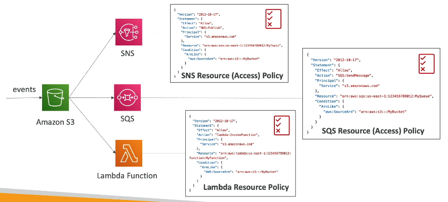

### S3 Baseline Performance

- Amazon S3 automatically scales to high request rates, latency 100-200 ms
- Your applciation can achieve at least 3,500 PUT/COPY/POST/DELTE or 5,500 GET/HEAD requests per second per prefix in a bucket
- There are no limits to the number of prefixes in a bucket
    - The prefix is anything between the name of the bucket and the name of the file
    - Example (object path => prefix)
        - bucket/folder1/sub1/file => /folder1/sub1/
        - bucket/folder1/sub2/file => /folder1/sub2/

### S3 Performance

- Multi-Part upload
    - recommended for files > 100MB
    - must use for files > 5GB
    - Can help parallelize uploads (seed up transfers)

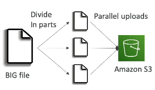

- S3 Transfer Acceleration
    - Increase transfer speed by trasnferring file to an AWS edge location which will forward the data to the S3 bucket in the target region
    - Compatible with multi-part upload

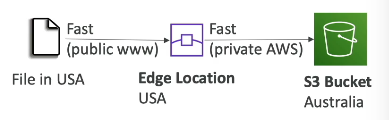

#### Byte-Range Fetches

- Parallelize GETs by requesting specific byte ranges
- Better resilience in case of failures
- Can be used to speed up downloads
- Can be used to retrieve only partial data

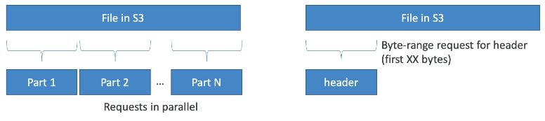

### S3 - Object Encryption

- You can en crypt objects in s3 buckets using one of 4 methods
- Server-Side Encryption (SSE)
    - SSE-S3
        - Encryption using keys handled, managed, and owned by AWS
        - Object is encrypted Server-Side
        - Encryption type is AES-256
        - Must set header "x-amz-server-side-encryption":"AWS256"
        - Enabled by default for new buckets & new objects
        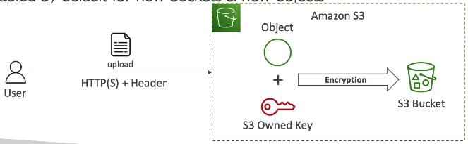
    - SSE-KMS
        - Encryption using keys handled and managed by AWS KMS (Key Management Service)
        - KMS advantages: user control + audit key usage using CloudTrail
        - Object is encrypted server side
        - Must set header "x-amz-server-side-encryption":"aws:kms"
        - Limitations
            - If you use SSE KMS you may be impacted by the KMS limits
            - When you upload, it calls the GenerateDataKey KMS API
            - When you download, it calls the Decrypt KMS API
            - Count towards the KMS quota per second (5500, 10000, 30000 req/s based on region)
            - You can request a quota increase using the Service Quotas Console
        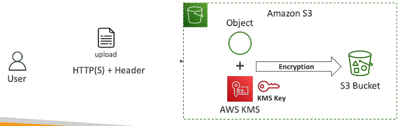
    - SSE-C
        - Server-Side Encryption using keys fully managed by the customer outide of AWS
        - Amazon S3 does NOT store the encryption key you provide
        - HTTPS Must be used
        - Encryption key must be provided in HTTP headers, for every HTTP request made
        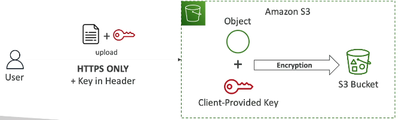
- Client-Side Encryption
    - Use client libraries such as Amazon S3 Client-Side Encryption Library
    - Clients must encryption data them selves before sending to Amazon S3
    - CLients must decrypt data themselves when retrieving from Amazon s3
    - Customer fully manages the keys  and encrypttion cyle
    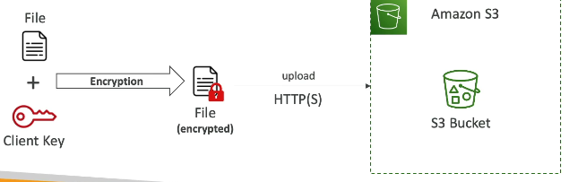
- Encryption in transit (SSL/TLS)
    - Amazon S3 exposes two endpoints:
        - HTTP Endpoint
        - HTTPS Endpoint
    - Optionallly we can "force encryption" using a bucket policy and refuse any API call to PUT an S3 object without encryption headers (SSE-KMS or SSE-C)
    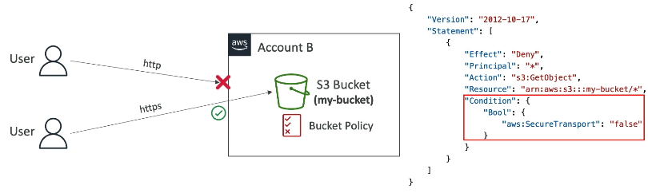
- It's important to understand which ones are for which situation for the exam

### S3 Access Points

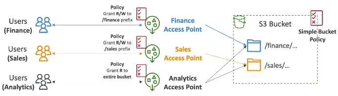

- Each accespoint has:
    - its own DNS name (Internet Origin or VPC Origin)
    - an access point policy

#### Access Points - VPC Origin

- We can define the access point to be accesible only from within the VPC
- You must create a VPC Endpoint to access the Access point (Gateway or Interface Endpoint)
- The VPC Endpoint Policy must allow access to the target bucket and Access Point

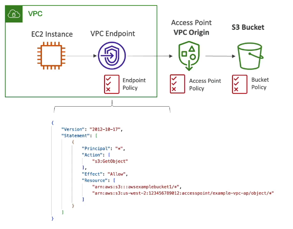

### S3 Object Lambda

- Use AWS Lambda Function to change the object before it is retrieved by the caller application
- Only one S3 bucket is needed, on top of which we create S3 Access Point and S3 Object Lambda Access Points

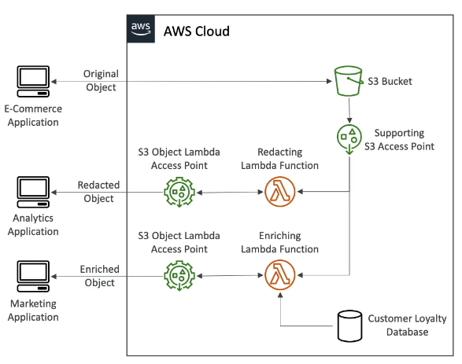

